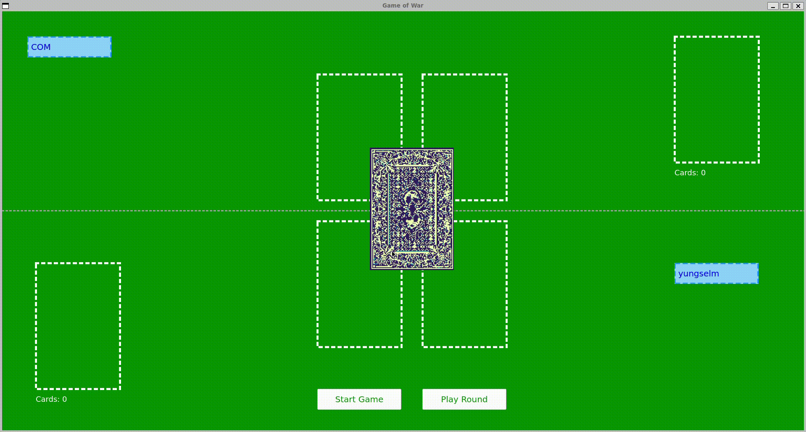

# Game of War (Rust Backend, Python Front End) <!-- omit in toc -->
## !!! Project currently unfinished !!!
## Description
This is an implementation of the card game ["War"](https://en.wikipedia.org/wiki/War_(card_game)).
Backend is run in Rust and Python's PyQt5 is used for Frontend. The program is developed for Linux OS (Ubuntu 22.04.).

## Installation
```bash
    python3 -m venv env
    source env/bin/activate
    pip install maturin
    maturin develop
    pip install poetry
    poetry install
```
This installs all the dependencies for python and rust automatically.

## Running
To run the program just type:
```bash
    python3 main.py
```

## GUI Layout
